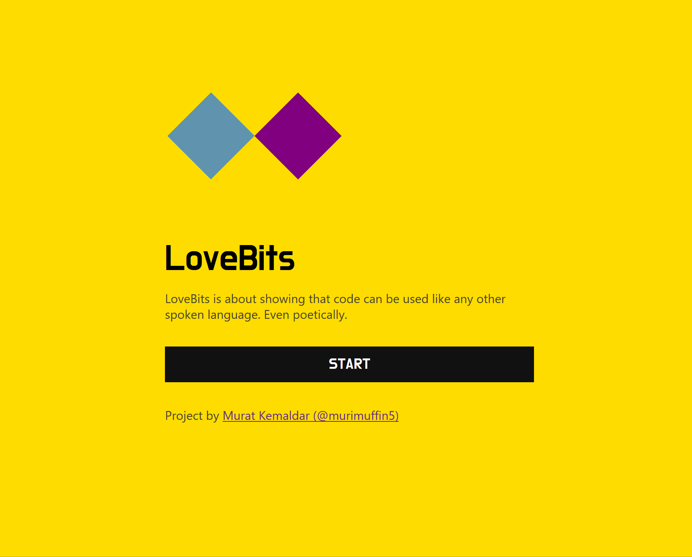

# LoveBits

## What is LoveBits?

LoveBits is a small experience meant to make coding languages more appealing to non-developers by writing JavaScript code poems.

Main ideas:

- Combining code with something "that you can do with human languages" (like poems) to create a different approach to coding
- Putting the message of code before the basics of coding

## But... why?

There are a lot of misconceptions about coding. People get intimitated, and don't know where to start because they don't treat it like a human language.

You can read more about it on [the article I wrote for the Smashing Magazine](https://www.smashingmagazine.com/2018/07/writing-code-poems/).

## Contribution

This is my first open-source project.

Please create a fork and create Pull Requests for new poems, improvements, and more. If you have any questions or need feedback to create a new poem, just let me know.

My

**Here are some topics you can help with, if you want to**:

- New poems
- Responsiveness (This is somewhat big, because of static numbers in poems. Needs some effort.)
- Tests?

## Development

Fork and clone the project.

`npm install`

`npm start`

Currently I deploy the project manually on https://lovebits.bilebile.net, but I am planning to use Netlify at some point.

## Tech

- React (for the UI)
- Paper.js (for the interactive parts of each poem)

## Author

Murat Kemaldar / [@murimuffin5 (Twitter)](https://twitter.com/murimuffin5)

## License

MIT License
